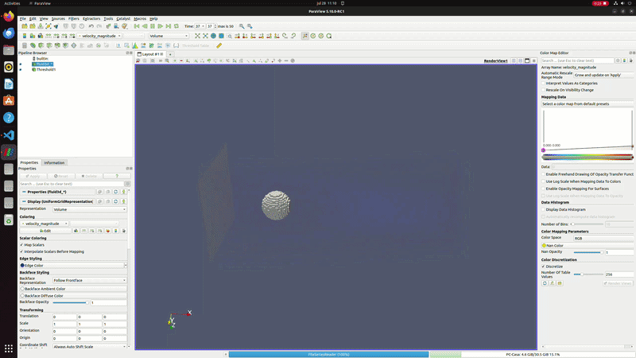

# lbm-heterogeneous-autotuning

Solver LBM (Lattice Boltzmann) para CFD con reparto dinámico de trabajo entre CPU y GPU.
Proyecto de verano.



## Motivación

La mayoría de trabajos sobre autotuning en cómputo tipo stencil deciden el reparto CPU/GPU
(o la precisión numérica) una única vez, al principio de la ejecución. Este proyecto explora
qué pasa si esa decisión se reajusta **mientras la simulación corre**, usando medidas reales
de rendimiento en lugar de una configuración fija.

## Estado actual

| Fase | Contenido | Estado |
|------|-----------|--------|
| 1 | Solver LBM D2Q9 funcional en CPU Secuencial | Realizado |
| 2 | Solver LBM D2Q9 funcional en CPU (OpenMP) | Realizado |
| 3 | Solver LBM D2Q9 funcional en GPU (CUDA) | Realizado |
| 4 | Solver LBM D2Q9 funcional en CPU (OpenMP) y GPU (CUDA), reparto fijo | Realizado |
| 5 | Solver 3D funcional en GPU (CUDA) | Realizado |
| 6 | Bucle de reajuste dinámico del reparto CPU/GPU en tiempo de ejecución | Pendiente |
| 7 | Precisión adaptativa por zonas (FP16/FP32) | Exploratorio / trabajo futuro |

## Estructura del repositorio

.
├── CLAUDCODE.md
├── docs
│   ├── makefile_info.md
│   └── media
│       └── gif_readme.gif
├── Makefile
├── README.md
├── results
│   ├── phase1
│   ├── phase2
│   └── phase3
└── src
├── Phase1_Sequential
│   └── main.cc
├── Phase2_OpenMP
│   └── main.cc
└── Phase3_Cuda
└── main.cu

## Compilar y ejecutar

Requiere `gcc` con soporte OpenMP. `nvcc` es opcional: si no está disponible, el proyecto
se compila igualmente y solo queda activo el backend de CPU.

```bash
make            # compila (detecta automáticamente si hay CUDA disponible)
make run        # compila y ejecuta con parámetros por defecto
make clean      # limpia binarios y objetos